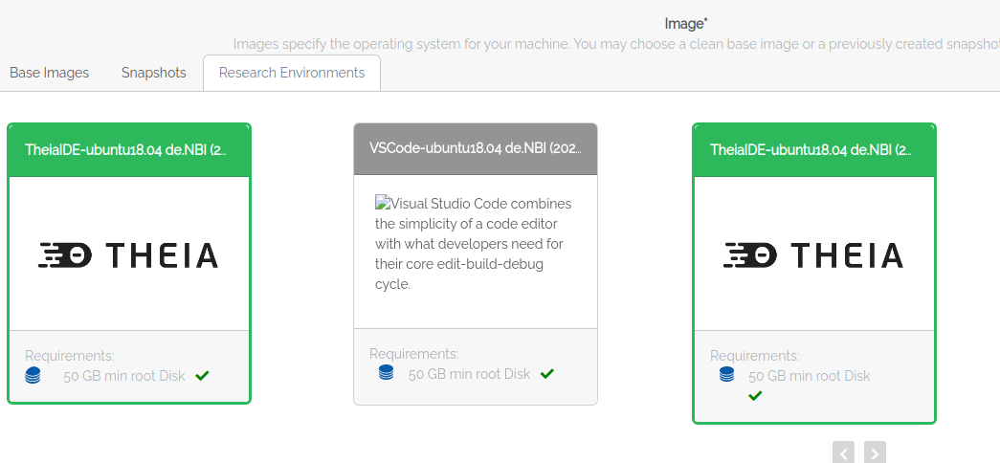
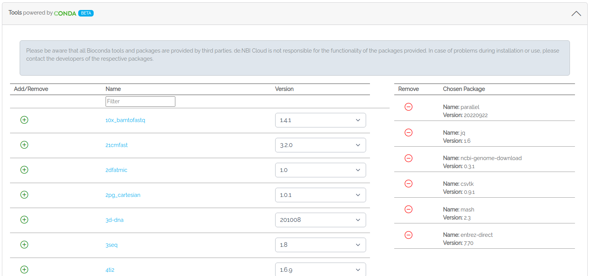
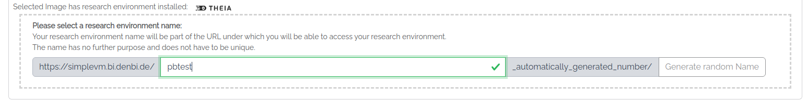
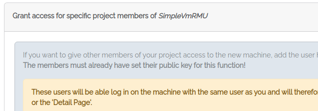

## Part 1: Big things start small

Since you are new to SimpleVM, it is resource-saving to start with a VM that
has a few cores and a small amount of RAM.

You start this tutorial from your profile page (https://cloud.denbi.de/portal/).

### 1.1 Create a de.NBI Cloud Account

If you do not have a de.NBI Cloud account, please register for one
via this link: https://cloud.denbi.de/register.
You can read more about the registration process in our 
de.NBI Cloud wiki: https://cloud.denbi.de/wiki/registration/.
Please make sure to to click on “continue” if this button shows up.

If you successfully registered for a de.NBI Cloud account,
you should be able to log in to the de.NBI Cloud Portal: https://cloud.denbi.de/portal/.

### 1.2 Select the SimpleVMIntro23 project

1. Click on the `New Instance` tab.

2. If you are already member of a SimpleVM project then you are offered a drop down menu to select
a project. In this case please select the **SimpleVMIntro23** project. If this is
your first SimpleVM project, you are now able to select/generate a key (next point) or directly start a VM.

3. If you have no SSH key set so far, just click on generate key and save the
private key. During this workshop you will not need this file because 
you will access all VMs via the browser. However, for your future work using
SimpleVM, we highly recommend to read our de.NBI Cloud wiki regarding
SSH keys: https://cloud.denbi.de/wiki/portal/user_information/#ssh-key

### 1.3 Start a VM

1. Choose a name for your VM.
2. Select **de.NBI default**.
3. In the image section, please click on the *Research Environments* tab 
   and select the **TheiaIDE-ubuntu22.04** image.
   
4. Select the Conda tab and choose the following tools with their version numbers given below for installation via Conda:
   * ncbi-genome-download (0.3.3)
   * mash (2.2)
   * csvtk (0.28.0)
   * entrez-direct (16.2)
   * jq (1.6)
   * parallel (20230922)
   
   
   The filter in the name column can be used to search for the packages.
   You will learn in the next sections how to apply these tools.

4. Select a URL path for Theia. You will access Theia via this URL.
   
5. Grant access to all project members with a `Cloud-portal-support` tag.
   This way these members get ssh access to your VM and can help you in case
   something does not work as expected.
   
6. Confirm the checkboxes and click on Start.

Next to [Section 2](part2.md)
