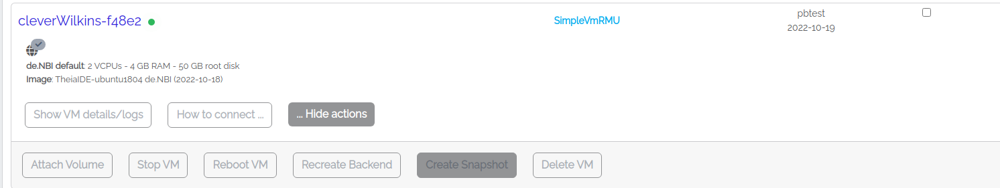

## Section 2: Verify your VM properties and tools

After the start of the machine has been triggered, some time may pass before the machine is available.
As soon as this is the case, this becomes visible via a green icon.

Once the VM is available, you can use it for testing the tools and inspecting the data before
you scale up your analysis in the next section.

### 2.1 Check your VM

Log in to the VM and verify that SimpleVM provisioned the VM correctly.

1. Click on the Instances tab (Overview -> Instances). After you have initiated the start-up of the machine, you should have been automatically redirected there. Now open the "How to connect"
   dropdown of your machine. Click on the Theia ide URL which opens a new browser tab.
   
2. Click on `Terminal` in the upper menu and select `New Terminal`.
   
3. Inspect the VM before starting to work with it. Let's check whether the VM
   has the properties that SimpleVM promised you by typing the following commands
   in your newly opened terminal window.
   `nproc` tells you the number of processing units.
   ```
   nproc
   ```
   Does that correspond to the actual number of cores of the flavor you selected?
   `free -h` tells you the amount of RAM that is available to your VM. You will see
   that the sum of the total amount of SWAP and Mem (first column) corresponds 
   roughly to the RAM size of your selected flavor.
   ```
   free -h
   ```
   You can also check what kind of processes are running on your VM by executing `top`
   or `htop`.
   ```
   htop
   ```
   Exit `htop` by typing `q` or `F10`.

4. You can use the tools you selected in the previous part by running `conda activate denbi`.

5. Test if the needed commands are installed by running all of them with -h parameter.
   You will get an explanation of their usage in the next chapter.

   * `ncbi-genome-download -h`
   * `mash -h`
   * `csvtk -h`
   * `jq -h`
   
   If there is an error reported, then something went wrong, and we have to either
   repeat the conda installation manually or install it a different way.

6. Remember that you have root permissions on the VM. You can install any
   tool that you need for your research.
   Let's test this statement by installing the following commands via `sudo`.
   ```
   sudo apt install -y fortune-mod cowsay
   ```
   and run both commands via
   ```
   /usr/games/fortune | /usr/games/cowsay 
   ```

### 2.2 Search for a genome 

We will search for a genome in our dataset by using Mash. Mash needs first
to index the genome via `mash sketch` and search for it in a metagenome dataset by using `mash screen`.
We will plot a histogram on the terminal for a quick check.

1. Let's download an example genome and dataset by running
   ```
   ncbi-genome-download -o output --flat-output  -s refseq -A GCF_000806805.1 bacteria -F fasta
   ```
   and
   ```
   wget https://openstack.cebitec.uni-bielefeld.de:8080/ftp.era.ebi.ac.uk/vol1/fastq/SRR398/008/SRR3984908/SRR3984908_1.fastq.gz
   ```

2. Create a mash sketch of the genome
   ```
   mash sketch output/GCF_000806805.1_CFSAN024778_01.0_genomic.fna.gz
   ```
   Check if the index is created
   ```
   ls -la output/GCF_000806805.1_CFSAN024778_01.0_genomic.fna.gz.msh
   ```

3. Check if a randomly chosen dataset contains our genome.  
   ```
   mash screen -p 2 output/GCF_000806805.1_CFSAN024778_01.0_genomic.fna.gz.msh SRR3984908_1.fastq.gz > out.txt
   ```

4. You can view the results by using cat. You will see that there is just one match.
   ```
   cat out.txt
   ```

### 2.3 Create a Snapshot

Since your tools work as expected, you should now create a snapshot of your
VM for later use. Please click on `Show Actions` and `Create Snapshot`.
Please use your name without whitespace (Example: Max Mustermann -> MaxMusterman).
The upload of your snapshot might take a few minutes.



Back to [Section 1](part1.md) | Next to [Section 3](part3.md)