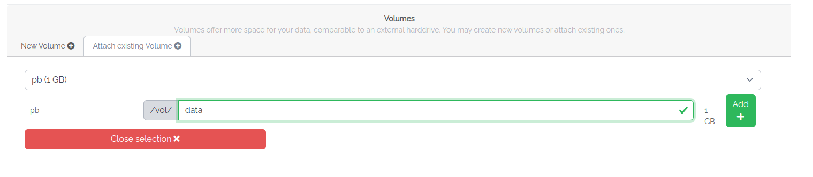
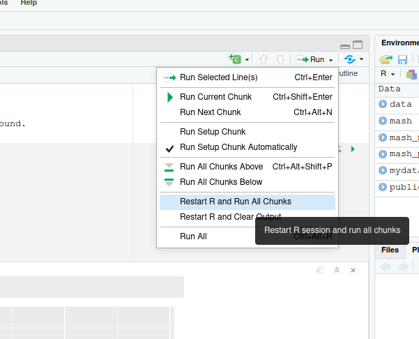

## Part 4: Inspect your generated data via a research environment

We now want to start a new VM. This time we would like to use RStudio 
in order to inspect and visualize our results.

### 4.1 Create a VM based on a Research Environment

1. Start a new VM. This time select again the de.NBI default flavor since
   we do not need that much resources anymore.

2. In the image tab please select Rstudio (`RStudio-ubuntu2004`).
   
3. In the volume tab please choose the volume you created
   in the previous part of the workshop.
   Please use again `/vol/data` as mountpath. Click on `Add +` to add the volume.
   

4. Grant again access to all project members with a `Cloud-portal-support` tag.
   This way these members get ssh access to your VM and can help you in case
   something does not work as expected.
   

5. Confirm all checkboxes and click on start.

6. Again it will take some while to start the machine. On the instance overview, select `How to connect` of the newly started VM 
   and click on the URL. A tab should be opened up in your browser.

### 4.2 RStudio

1. Login credentials for the RStudio user login are.
   ```
   Username: ubuntu  
   Password: simplevm
   ```

2. In RStudio please open a Terminal first by either selecting the `Terminal` tab, or by clicking on
   `Tools` -> `Terminal` -> `New Terminal`.

3. Download the Script by running wget:
   ```
   wget https://openstack.cebitec.uni-bielefeld.de:8080/simplevm-workshop/analyse.Rmd
   ```   
   
4. Further you have to install necessary R libraries. Please switch back
   to the R console:
   
   
   Install the following libraries: 
   ```
   install.packages(c("ggplot2","RColorBrewer","rmarkdown"))
   ```
5. You can now open the `analyse.Rmd` R notebook via `File` -> `Open File`.

6. You can now start the script by clicking on `Run` -> `Restart R and run all chunks`.
  

### 4.3 Provide your research data to a reviewer

Finally, you may want to publish your results once you are done with your research project.
You could provide your data and tools via your snapshot and volumes to a reviewer,
who could reproduce your results. Alternatively, you can also provide the Rmarkdown document 
together with the input data to reproduce the last part of the analysis and the visualization.

You can share your research results via Zenodo, Figshare and other providers who will generate 
a citable, stable Digital Object Identifier (DOI) for your results. [re3data](https://www.re3data.org/)
provides an overview of research data repositories that are suitable for your domain-specific research
results.

Back to [Part 3](part3.md)
