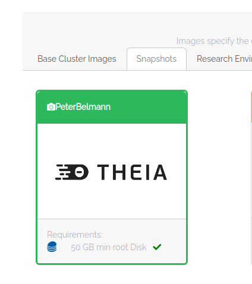
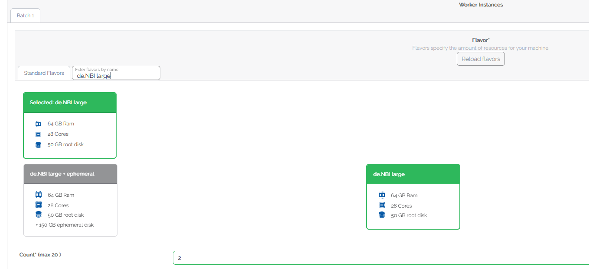

## Section 5 (Part 1): Scale up your analysis horizontally 

In this part of the tutorial you will scale up your cluster horizontally by using a SimpleVM Cluster.
A SimpleVM Cluster consists of a master and multiple worker nodes. On all nodes a SLURM workload manager
will be installed. SLURM allows you to submit scripts, so-called jobs, that are queued up and once there
are free resources (CPUs, RAM) available on one of the worker nodes the script will be executed on that node.
This way you don't have to look up which nodes are free in order to run your jobs.
In the following you will configure a cluster and submit your tools to a SLURM job scheduler. 

### 5.1 Create a Cluster

1. Click on "New Cluster" on the left menu.
   If you can not see the "New Cluster" item then reload the page.

2. Since your master node is just used for submitting jobs, please select *de.NBI mini* as flavor and
   the snapshot **SimpleVMIntro23** as image.
   
   The same snapshot will also be used for all worker nodes.
3. The worker nodes will run the actual tools, so we need a flavor wir more cores then the one
   that the master node is using. Therefore, please select *de.NBI large* as flavor and start
   two worker nodes by providing `2` as the worker count.
      

5. Now click on Start! That's it! Just with a few clicks you started your own cluster.

Back to [Section 4](part4.md) | Next to [Section 5 (Part 2)](part52.md)
