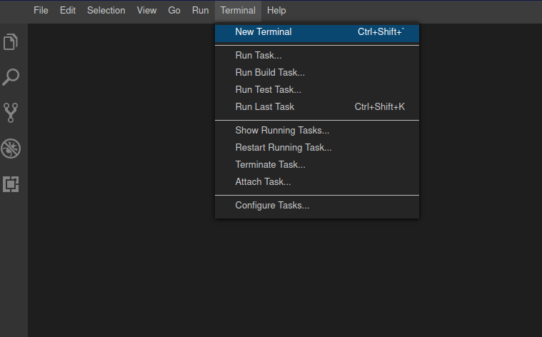
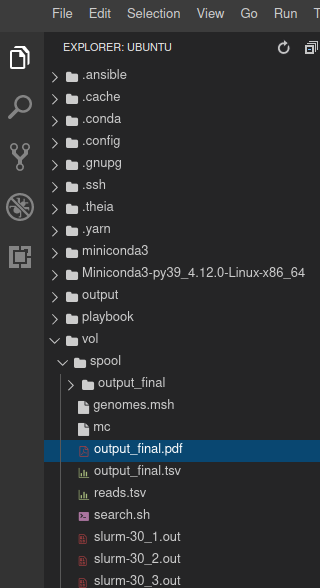

## Section 5 (Part 2): Scale up your analysis horizontally 

In the second part of section 5 you will investigate your cluster setup and use the infrastructure
for your computations.

### 5.2 Investigate your cluster setup

1. Click on the Clusters tab (Overview -> Clusters). After you have initiated the start-up of the cluster,
   you should have been automatically redirected there. Now open the "How to connect"
   dropdown of your machine. Click on the Theia ide URL which opens a new browser tab.

2. Click on `Terminal` in the upper menu and select `New Terminal`.
   

3. Check how many nodes are part of your cluster by using `sinfo`

```
sinfo
```
which will produce the following example output
```
PARTITION AVAIL  TIMELIMIT  NODES  STATE NODELIST
debug*       up   infinite      2   idle bibigrid-worker-1-1-us6t5hdtlklq7h9,bibigrid-worker-1-2-us6t5hdtlklq7h9
```

The important columns here are `STATE` which tells you if the worker nodes are processing jobs
or are just in `idle` state and the column `NODELIST` which is just a list of nodes.

4. You could now submit a job and test if your cluster is working as expected.
   `/vol/spool` is the folder which is shared between all nodes. You should always submit jobs
   from that directory.
   ```
   cd /vol/spool
   ```

5. Please fetch the script that we want to execute
   ```
   wget https://openstack.cebitec.uni-bielefeld.de:8080/simplevm-workshop/basic.sh
   ```
   The script contains the following content:
   ```
   #!/bin/bash
   
   #Do not do anything for 30 seconds 
   sleep 30
   #Print out the name of the machine where the job was executed
   hostname
   ```
   where
    * `sleep 30` will delay the process for 30 seconds.
    * `hostname` reports the name of the worker node.

6. You could now submit the job to the SLURM scheduler by using `sbatch` and directly after that
   check if SLURM is executing your script with `squeue`.

   sbatch:
   ```
   sbatch basic.sh
   ```
   
   squeue:
   ```
   squeue
   ```
   which will produce the following example output:
   ```
   JOBID PARTITION     NAME     USER ST       TIME  NODES NODELIST(REASON)
   212     debug basic.sh   ubuntu  R       0:03      1 bibigrid-worker-1-1-us6t5hdtlklq7h9
   ```
   Squeue tells you the state of your jobs and which nodes are actually executing them.
   In this example you should see that `bibigrid-worker-1-1-us6t5hdtlklq7h9` is running (`ST` column) your job
   with the name `basic.sh`.

7. Once the job has finished you should see a slurm output file in your directory (Example: `slurm-212.out`)
   which will contain the name of the worker node which executed your script.
   Open the file with the following command:
   ```
   cat slurm-*.out
   ```
   Example output:
   ```
   bibigrid-worker-1-1-us6t5hdtlklq7h9
   ```

8. One way to distribute jobs is to use so-called array jobs. With array jobs you specify how many times
   your script should be executed. Every time the script is executed, a number between 1 and the number of times
   you want the script to be executed is assigned to the script execution. The specific number is saved in a
   variable (`SLURM_ARRAY_TASK_ID`). If you specify `--array=1-100` then your script is 100 times executed and
   the `SLURM_ARRAY_TASK_ID` variable will get a value between 1 and 100. SLURM will distribute the
   jobs on your cluster.

   Please fetch the modified script
   ```
   wget https://openstack.cebitec.uni-bielefeld.de:8080/simplevm-workshop/basic_array.sh
   ```

   Which is simply reading out the `SLURM_ARRAY_TASK_ID` variable and placing them in a file in an
   output directory:

   ```
   #!/bin/bash
   
   # Create output directory in case it was not created so far
   mkdir -p output_array
   
   #Do not do anything for 10 seconds 
   sleep 10
   
   #Create a file with the name of SLURM_ARRAY_TASK_ID content. 
   touch output_array/${SLURM_ARRAY_TASK_ID}
   ```
 
   You can execute this script a 100 times with the following command 
   ```
   sbatch --array=1-100 basic_array.sh
   ```
   
   If you now check the `output_array` folder, you should see numbers from 0 to 100.
   ```
   ls output_array
   ```

### 5.3 Scan the SRA for genomes

1. We can now reuse the `search` function of the third part of this tutorial and
submit an array job with the number of datasets we want to scan. Remember the search function
searches a list of genomes in a list of metagenomic datasets. 

Please download the updated script by using wget:
```
wget https://openstack.cebitec.uni-bielefeld.de:8080/simplevm-workshop/search.sh
```
<details><summary>Show Explanation</summary>
This is the content of the script
<code>
#!/bin/bash

#Create an output directory
mkdir output_final

#Use the conda environment you installed in your snapshot and activate it
eval "$(conda shell.bash hook)"
conda activate denbi

#Add S3 SRA OpenStack Config
/vol/spool/mc config host add sra https://openstack.cebitec.uni-bielefeld.de:8080 "" ""

#Define search function you have already used in part 3
search(){
   left_read=$(echo $1 | cut -d ' '  -f 1);  
   right_read=$(echo $1 | cut -d ' ' -f 2);
   sra_id=$(echo ${left_read} | rev | cut -d '/' -f 1 | rev | cut -d '_' -f 1 | cut -d '.' -f 1);
   /vol/spool/mc cat $left_read $right_read | mash screen -p 3 genomes.msh - \
        | sed "s/^/${sra_id}\t/g"  \
        | sed 's/\//\t/' > output_final/${sra_id}.txt ;
}

#Create a variable for the array task id
LINE_NUMBER=${SLURM_ARRAY_TASK_ID}
LINE=$(sed "${LINE_NUMBER}q;d" reads2.tsv)

#Search for the datasets
search ${LINE} 
</code>
</details>

2. The input for the script is a file containing fastq datasets (`reads.tsv`) and
a file containing a sketch of the genomes.

Fastq datasets:
```
wget https://openstack.cebitec.uni-bielefeld.de:8080/simplevm-workshop/reads2.tsv
```

Sketch:
```
wget https://openstack.cebitec.uni-bielefeld.de:8080/simplevm-workshop/genomes.msh
```

3. We also need to download `mc` again since it was not saved as part of the snapshot.

```
wget https://dl.min.io/client/mc/release/linux-amd64/mc
```

Please set executable rights:

```
chmod a+x mc
```

4. You can execute the array job by using the following command:

```
sbatch --array=1-386 search.sh
```

5. You could now check the state of your jobs by using `squeue`.
   Please note that the job execution might take a few hours. The VM will be available even after the workshop.
   If you are interested in the results, you could plot them later.

6. Concatenate all results into one file via `cat output_final/*.txt > output_final.tsv`

7. Let's plot how many genomes we have found against the number of their matched k-mer hashes:
   Activate the denbi conda environment:
   ```
   conda activate denbi
   ```
   Run `csvtk` on the output
   ```
   csvtk -t plot hist -H -f 3 output_final.tsv -o output_final.pdf
   ```
   You can open this file by a click on the Explorer View and selecting the pdf.
   
    
   Since there are many matches with a low number of k-mer hashes, you could filter the table first and plot
   the filtered results.
   ```
   sort -rnk 3,3 output_final.tsv | head -n 50 > output_final_top50.tsv
   ```   

   ```
   csvtk -t plot hist -H -f 3 output_final_top50.tsv -o output_final_top50.pdf
   ```

8. Finally, you could view the top matches via `less` and check their description on the 
   [SRA website](https://www.ncbi.nlm.nih.gov/sra) by providing the SRA run accession
   (Example `ERR4181696`) for further investigation.
   ```
   less output_final_top50.tsv
   ```

Back to [Section 5 (Part 1)](part51.md)
